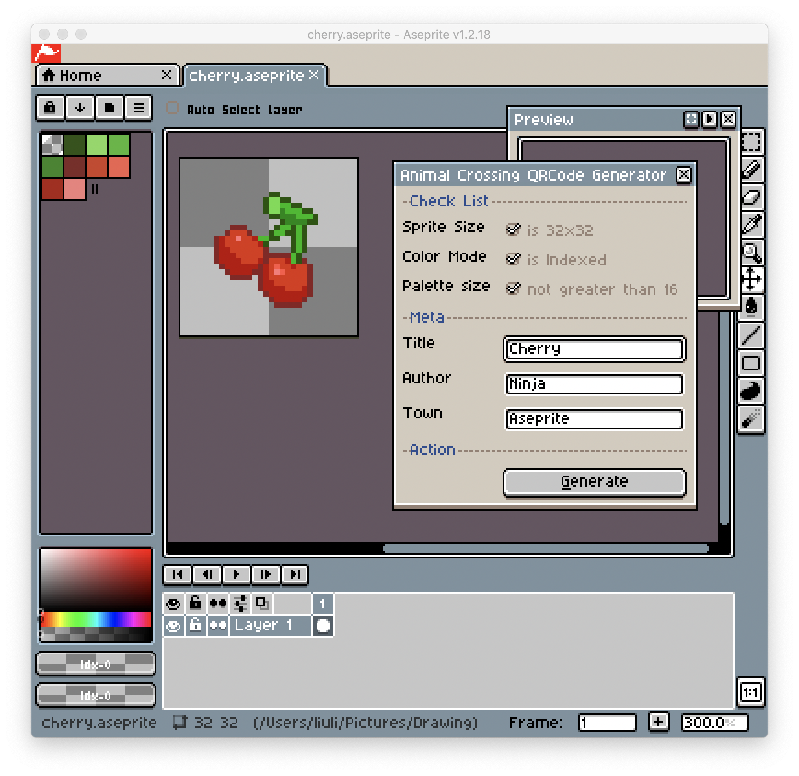
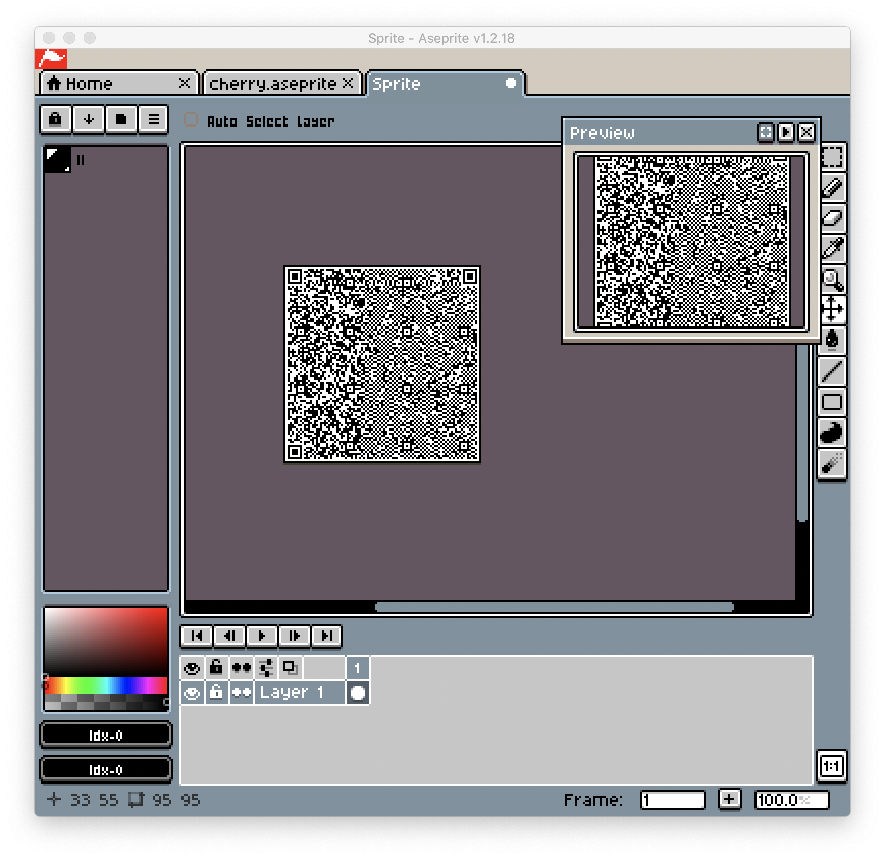

# Animal Crossing QRCode Generator for Aseprite

This is a custom script for generate Animal Crossing QRCode in [Aseprite](http://www.aseprite.org/).

Works on aseprite v1.2.18 or later.

## Install

1. Download the repo as Zip file.
2. Open Aseprite, Select `File > Scripts > Open Scripts Folder`.
3. Extract the zip in the Scripts folder, and rename it to `animalcrossing`.
4. Restart Aseprite.

P.S. the `lib` folder is a necessary part of this script, so please leave it with `generate-qrcode.lua`.

You can also attach a shortcut to this script, more instruction can be found at [this post](https://community.aseprite.org/t/aseprite-scripts-collection/3599).

## Type

Currently, the generator supports the 32 x 32 basic custom design and 64 x 64 pro design.

The 32 x 32 sprite can generates plain easel (paint), knit cap and horned hat.

The 64 x 64 sprite can geneartes shirt and dress with half sleeves, long sleeves or without sleeves.

## Usage

1. Setup a Sprite with `32px` or `64px` width and height.
2. Change Color Mode to `Indexed`.
3. Setup a palette with no more than 16 colors (including transparent).
4. Enjoy drawing.
5. Export QRCode by clicking `File > Scripts > animalcrossing > generate-qrcode`.
6. Edit the Title/Author/Town in the dialog.
7. Click `Generate` button to create a new sprite with QRCode.
8. Scan the QRCode with Nintendo Switch mobile app.




### User Preference

Aseprite doesn't support user preference at the moment this script had been made. 

But you could create or edit the `settings.lua` in the script folder to pre-fill your detail, so that you don't need to refill these setting every time you want to generate the QRCode. 

```lua
-- settings.lua
return {
    title = 'Untitled',
    author = 'Mutoo',
    town = 'Aseprite',
}
```

## Pattern

You may draw anything on 32 x 32 sprite, but for 64 x 64 sprite, you should draw with a certain pattern, so that the plugin could generate the clothing type correctly.


For shirt type, it would use the top section with bottom section for sleeves. And it would ignore the middle section.

For dress type, it would also use the middle section for extra space, since it's longer then shirt.

The top section and the middle section can be divided into left and right parts. The right part is for front side, vice versa.

The bottom section is for sleeves, and the left part is for right arm (sounds odd, but you may think about the model is facing at you), vice versa.

The short sleeves use 50% horizontal space of each sleeve. And for sleeveless type, it just ignores the bottom section. 

## Todo

It's worth to develop a 3D model to preview the design.

## Limitation

The palette is limit to 16 colors with transparent, and when being exported to qrcode, it would be converted to the closest colors in the internal palette (check `lib/palettes.lua` for reference).

N.B. The design will not be editable on both Animal Crossing New Leaf or Animal Crossing New Horizons due to the lack of user identification in the data.

## License

MIT

## Credits

Thanks [Thulinma](https://github.com/Thulinma/) for creating the [ACNLPatternTool Web App](https://acpatterns.com/).
The ACNL data layout and palettes are extracted from that repo and ported to Lua language.

Thanks Patrick Gundlach for creating the [luaqrcode](http://speedata.github.io/luaqrcode/docs/qrencode.html).
